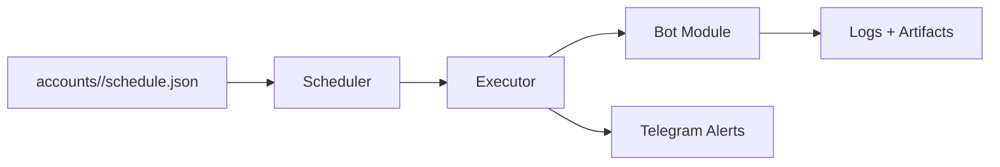

# FB Automation Pro — Facebook Ops Automation Suite

Kelola banyak akun Facebook seperti tim social media beneran: jadwal, workflow, logging, dan notifikasi real-time.

- [➡️ Landing Page (Download + License)](https://facebookpro.gt.tc/)
- [Feature List](FEATURES.md)
- [Roadmap](ROADMAP.md)
- [Plans & Pricing](PLANS.md)
- [Security](SECURITY.md)
- [FAQ](FAQ.md)
- [Setup Guide](SETUP.MD)

## Apa Ini?
Repo ini adalah **repo promosi/preview**. Struktur ditampilkan untuk memberi gambaran sistem, tapi **kode operasional tidak disertakan** di sini.

Untuk versi lengkap (full source + installer + template + update), akses:

### [➡️ Dapatkan Versi Full (License)](https://facebookpro.gt.tc/)

## Kenapa Orang Beli (Value Utama)
- **Hemat waktu**: aktivitas rutin jalan otomatis dengan jadwal yang bisa kamu atur.
- **Multi-akun rapi**: tiap akun punya konfigurasi & schedule sendiri.
- **AI yang relevan**: komentar/caption bisa mengikuti konteks (persona + anti repetisi).
- **Monitoring dari Telegram**: start/stop bot + alert error langsung dari HP.
- **Audit trail**: log aktivitas + dedupe supaya tidak mengulang media/post yang sama.
- **Hardening build**: dukungan build terenkripsi untuk distribusi (proteksi code saat deploy).

## Modul Inti (Yang Paling Dicari)
- Scheduler pintar (cron/time window + random delay)
- Multi-account executor (isolasi proses per bot)
- Cookie management + auto refresh (opsional 2FA)
- Telegram controller + notification center
- AI integration (Gemini/OpenRouter/Groq + fallback)

## Kapabilitas Bot (Ringkas)
- Autolike (timeline / group / reels)
- Confirm friend requests
- Comment (group / timeline / video)
- Reply komentar/mention (anti spam + dedupe)
- Scrape reels URL + share reels
- Update status (text + photo, local/AI priority)
- Upload reels (local/download priority + logging processed)
- View story (dedupe story viewed)

Detail lengkap: lihat [FEATURES.md](FEATURES.md).

## Preview Workflow (Konsep)

## Yang Kamu Dapat (Versi Full)
- Full source + semua modul bot
- Template config per akun + wizard account setup
- Setup scripts (Windows/VPS) + PM2 ecosystem
- Update berkala + support channel

## ⚠️ Disclaimer (Responsible Use)
Otomasi bisa bertentangan dengan ToS platform. Gunakan secara bertanggung jawab, atur limit, dan pahami risikonya. Pengembang tidak bertanggung jawab atas suspend/limit akibat penggunaan.

---

Siap bikin workflow Facebook kamu rapi dan scalable?

### [➡️ Unlock Full Version](https://facebookpro.gt.tc/)
